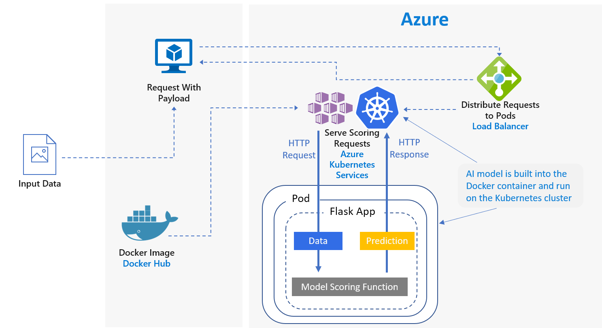

# This repo is no longer actively maintained. We suggest using [this version](https://github.com/Microsoft/MLAKSDeployAML) which leverages Azure Machine Learning service.

### Authors: Fidan Boylu Uz and Mario Bourgoin

# Deploying Python models on a Kubernetes Cluster for real-time scoring

## Overview
This scenario shows how to deploy a Frequently Asked Questions (FAQ) matching model as a web service to provide predictions for user questions. For this scenario, “Input Data” in the architecture diagram refers to text strings containing the user questions to match with a list of FAQs. The scenario is designed for the Scikit-Learn machine learning library for Python but can be generalized to any scenario that uses Python models to make real-time predictions.

## Design

The scenario uses a subset of Stack Overflow question data which includes original questions tagged as JavaScript, their duplicate questions, and their answers. It trains a Scikit-Learn pipeline to predict the match probability of a duplicate question with each of the original questions. These predictions are made in real time using a REST API endpoint.
The application flow for this architecture is as follows:
1.	The client sends a HTTP POST request with the encoded question data.
2.	The Flask app extracts the question from the request
3.	The question is then sent to the Scikit-learn pipeline model for featurization and scoring. 
4.	The matching FAQ questions with their scores are then piped into a JSON object and returned to the client.

An example app that consumes the results is included with the scenario.

## Prerequisites
1. [Linux(Ubuntu)](https://docs.microsoft.com/azure/machine-learning/data-science-virtual-machine/dsvm-ubuntu-intro).
2. [Anaconda Python](https://www.anaconda.com/download)
3. [Docker](https://docs.docker.com/v17.12/install/linux/docker-ee/ubuntu) installed.
4. [DockerHub](https://hub.docker.com/) account.
5. [Azure account](https://azure.microsoft.com).

The tutorial was developed on an [Azure Ubuntu DSVM](https://docs.microsoft.com/azure/machine-learning/data-science-virtual-machine/dsvm-ubuntu-intro), which addresses the first three prerequisites.

## Setup
To set up your environment to run these notebooks, please follow these steps.  They setup the notebooks to use Docker and Azure seamlessly.
1. Create a _Ubuntu Linux_ DSVM.
2. Open a bash shell on the DSVM.
3. Add your login to the `docker` group:
   ```
   sudo usermod -a -G docker <login>
   ```
   You can check you are in the `docker` group by listing your account's groups using the command:
   ```
   groups
   ```
   You may need to log out and log back in for this change to take effect. 
4. Login to your DockerHub account:
   ```
   docker login
   ```
5. Clone, fork, or download the zip file for this repository:
   ```
   git clone https://github.com/Azure/MLAKSDeployment.git
   ```
6. Create the Python MLAKSDeployment virtual environment using the environment.yml:
   ```
   conda env create -f environment.yml
   ```
7. Activate the virtual environment:
   ```
   source activate MLAKSDeployment
   ```
8. Login to Azure:
   ```
   az login
   ```
9. If you have more than one Azure subscription, select it:
   ```
   az account set --subscription <Your Azure Subscription>
   ```
10. Start the Jupyter notebook server in the virtual environment:
   ```
   jupyter notebook
   ```

## Steps
After following the setup instructions above, run the Jupyter notebooks in order starting with [Data Prep Notebook](https://github.com/Azure/MLAKSDeployment/blob/master/00_Data_Prep.ipynb).

## Cleaning up
To remove the conda environment created on your Linux system see [here](https://conda.io/docs/commands/env/conda-env-remove.html). The last Jupyter notebook also gives details on deleting Azure resources associated with this repository.

# Contributing
This project welcomes contributions and suggestions.  Most contributions require you to agree to a Contributor License Agreement (CLA) declaring that you have the right to, and actually do, grant us the rights to use your contribution. For details, visit https://cla.microsoft.com.

When you submit a pull request, a CLA-bot will automatically determine whether you need to provide a CLA and decorate the PR appropriately (e.g., label, comment). Simply follow the instructions provided by the bot. You will only need to do this once across all repositories using our CLA.

This project has adopted the [Microsoft Open Source Code of Conduct](https://opensource.microsoft.com/codeofconduct/). For more information see the [Code of Conduct FAQ](https://opensource.microsoft.com/codeofconduct/faq/) or contact [opencode@microsoft.com](mailto:opencode@microsoft.com) with any additional questions or comments.
